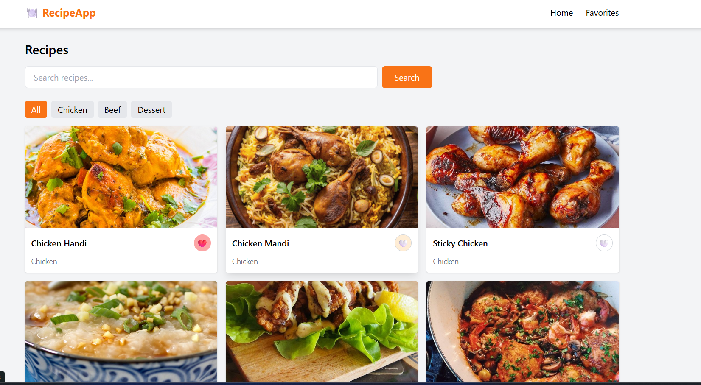
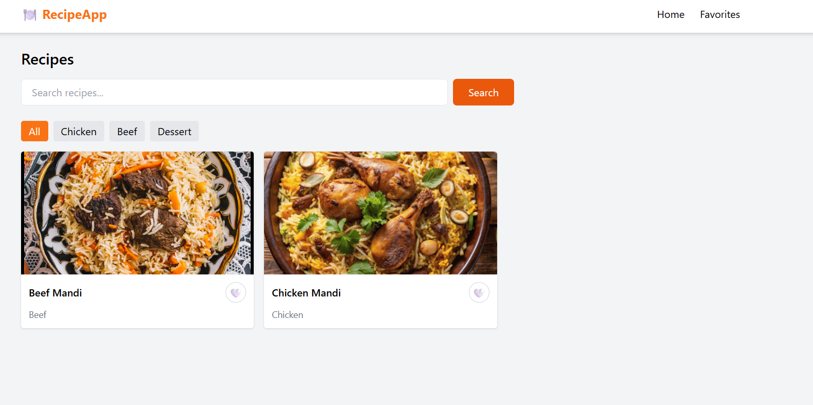
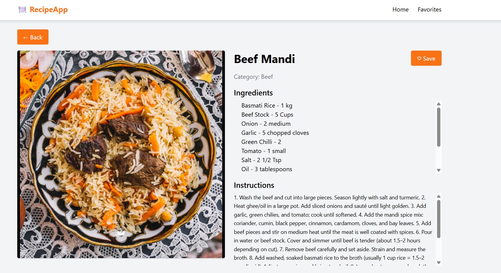
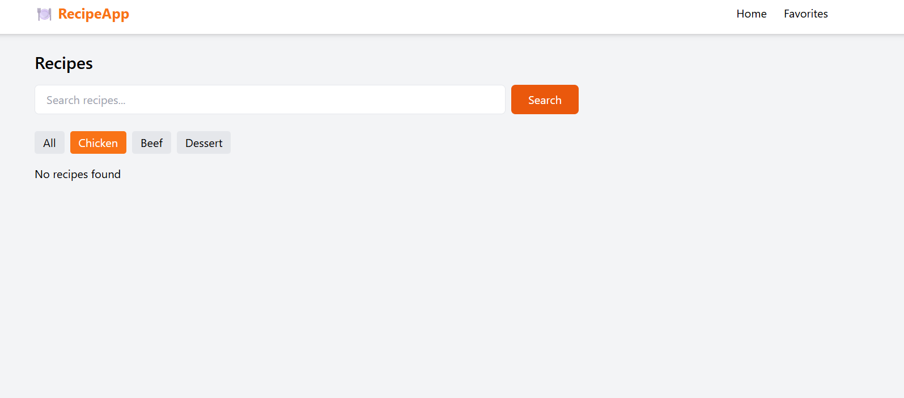
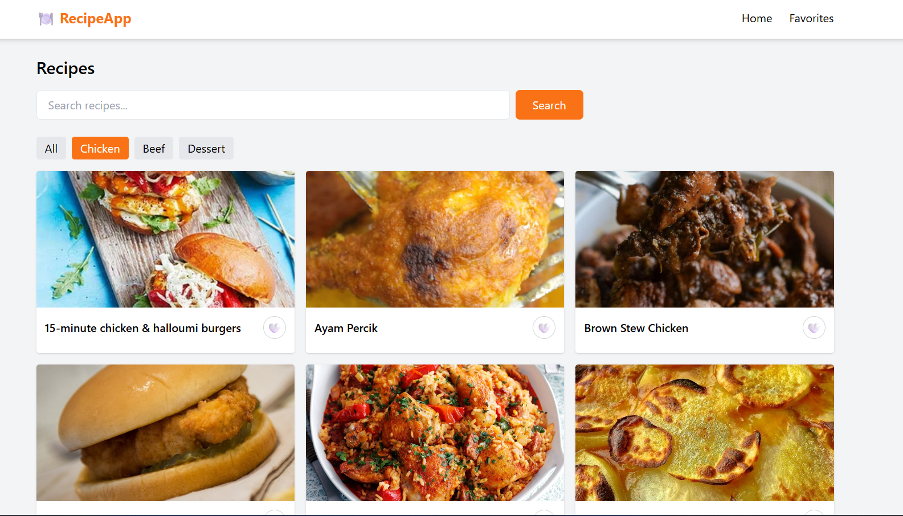
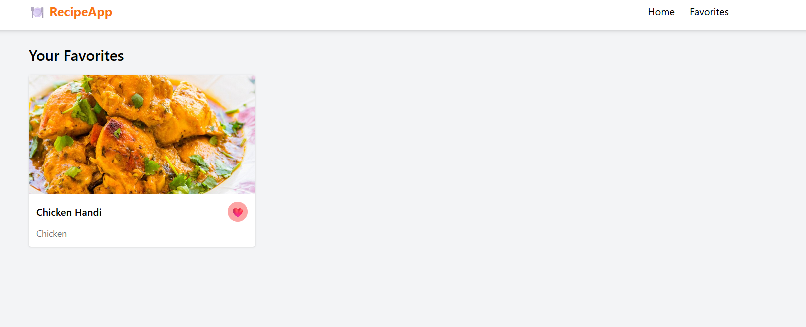

# 🍲 Recipe App

A dynamic and responsive recipe application built using React, Redux Toolkit, TypeScript, and Tailwind CSS. Users can browse, search, filter, and save their favorite recipes.

---

## 🚀 Live Demo

👉 https://your-netlify-link.netlify.app

---

## 📌 Features

* 🔍 Search recipes by name
* 🥗 Filter recipes by category (Chicken, Beef, Dessert, etc.)
* 📄 View detailed recipe information
* ❤️ Add and remove favorites
* 💾 Favorites persist using localStorage
* 📱 Fully responsive UI

---

## 🛠 Tech Stack

* React JS
* TypeScript
* Redux Toolkit
* React Router
* Tailwind CSS
* Axios
* MealDB API

---

## 📷 Screenshots

### 🏠 Home Page


### 🔍 Search Page


### 🎬 Movie Details


### 🚫 No Movies Found


### ✅ Filter 


###  ❤️ Favorite Page



---

## ⚙️ Installation

```bash
git clone git remote add origin https://github.com/Apoorva-Bairi/RecipeApp.git

cd recipe-app
npm install
npm run dev
```

---

## 🌐 API Used

https://www.themealdb.com/api.php

---

## ✨ Improvements Made

* Fixed UI issues and improved layout
* Implemented Favorites feature with persistence
* Improved search + filter functionality
* Added responsive design

---

## 📌 Author

Apoorva Bairi
